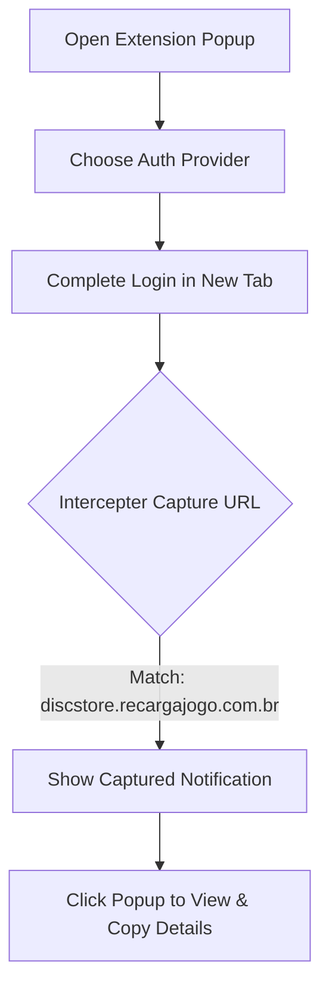

<p align="center">
 🌟 TSun-Eat-Token-Catcher 🌟

  
  
  
  
</p>

---

## 📖 Overview

**TSun-Eat-Token-Catcher** is a lightweight, high-performance Chrome Extension built on **Manifest V3**. It is specifically designed to automatically intercept and capture Garena EAT authentication token parameters during redirect flows. 

When a user initiates authentication, the extension detects the final redirect to `discstore.recargajogo.com.br` instantly extracting critical data fields:
*   `eat` (Access Token)
*   `region`
*   `account_id`
*   `nickname`

The captured data is formatted beautifully and displayed immediately in the extension popup with one-click copy functionality.

---

## ✨ Features

🎨 **Elegant Popup UI**  
A modern user-friendly dashboard built with external scripting to guarantee fully CSP-compliant execution.

⚡ **Instant Interception**  
Uses robust `chrome.tabs.onUpdated` hooks for real-time capture of credentials before target pages load.

🔑 **Multi-Provider Support**  
Seamlessly works with all standard Garena auth options:
*   `Google` / `Facebook` / `Apple` / `X (Twitter)` / `VK`

🔔 **Desktop Notifications**  
Triggers native OS notifications upon capture; clicking the notification opens the extension popup instantly.

📋 **Quick Copy System**  
Dedicated copy buttons for all credentials to streamline configuration and pasting.

🔄 **Auto-Update System**  
Checks the GitHub Releases endpoint every 30 minutes, showing a `NEW` badge and a click-to-update download button when updates are released.

---

## 🛠️ Installation

### 🚀 Developer Mode (Unpacked)

1. **Download/Clone** the repository to your local system:
   ```bash
   git clone https://github.com/TSun-FreeFire/TSun-Eat-Token-Catcher.git
   ```
2. Open Google Chrome and navigate to: `chrome://extensions/`
3. Toggle the **Developer mode** switch in the top-right corner.
4. Click the **Load unpacked** button in the top-left.
5. Choose the folder containing `manifest.json`.
6. Pin **TSun-Eat-Token-Catcher** to your extension bar!

---

## 📖 How to Use



1. **Select Provider**: Click the extension icon and select your preferred login platform (Google, Facebook, Apple, X, or VK).
2. **Authorize**: Authenticate on the official login page.
3. **Capture**: Once logged in, a notification appears confirming successful token catch.
4. **Copy**: Click the popup to access your data instantly.

---

## 📂 Project Structure

```bash
TSun-Eat-Token-Catcher/
├── background.js       # Background service worker (intercepts URLs & checks updates)
├── popup.html          # Clean & styled user interface
├── popup.js            # Safe popup interactivity logic
├── manifest.json       # Chrome Extension Manifest V3 configuration
├── convert.py          # Icon rasterization helper script
├── icon16.png          # App icon (16x16)
├── icon48.png          # App icon (48x48)
├── icon128.png         # App icon (128x128)
└── README.md           # Documentation
```

---

## ⚙️ Configuration Details

| Parameter | Value / Endpoint |
| :--- | :--- |
| **Target Host** | `discstore.recargajogo.com.br` |
| **Auth Base** | `https://auth.garena.com/universal/oauth` |
| **GitHub Updates** | `https://github.com/TSun-FreeFire/TSun-Eat-Token-Catcher` |

---

## 🔄 Auto-Update Protocol

Since unpacked developer extensions do not auto-update natively:
1. Every **30 minutes**, `chrome.alarms` triggers a check to GitHub Releases.
2. If a new version exists, the extension shows an orange **UP** badge and issues a notification.
3. Clicking **Update** downloads the new release `.zip` automatically.
4. **To apply**: Simply extract the ZIP, head to `chrome://extensions`, and click **Reload (🔄)** on the extension card.

---

## 📜 Changelog

### 🚀 v1.0.2 (Current)
*   **Security & Policy Compliance**: Fixed CSP violations by moving all inline scripts into `popup.js`.
*   **New Providers**: Integrated **Login with X (Twitter)** button in the UI.
*   **Enhanced UX**:
    *   Added system tray notifications upon successful capture.
    *   Added click-action on notification to open the popup.
    *   Added copy-to-clipboard actions for all token keys.
    *   Added state synchronization so popups refresh live when captures happen.

### 🌱 v1.0.0
*   Initial launch.
*   Intercepts redirect flow parameters seamlessly.
*   Added support for Garena OAuth universal targets.

---

## 🤝 Community & Support

*   🐛 **Report Issues:** Open a ticket on [GitHub Issues](https://github.com/TSun-FreeFire/TSun-Eat-Token-Catcher/issues).
*   ⭐ **Contributions:** Feel free to fork the repository and submit pull requests.

---

<p align="center">
  <sub>Built with ❤️ for the Free Fire community. Not affiliated with Garena or X Corp.</sub>
</p>
