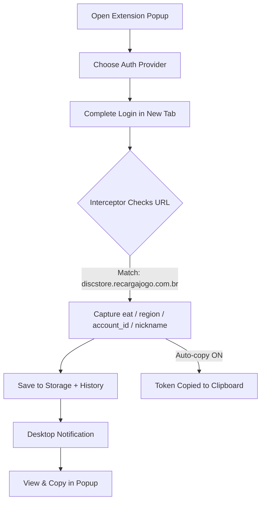

<div align="center">

# ⚡ TSun Eat Token Catcher

**A polished, tab-based Chrome extension that auto-captures Garena EAT authentication tokens.**

<p>
  
  
  
  
</p>

<p>
  
  
  
</p>

</div>

---

## 📖 Overview

**TSun-Eat-Token-Catcher** is a lightweight, high-performance Chrome extension built on **Manifest V3**. It automatically intercepts and captures Garena **EAT** authentication token parameters during OAuth redirect flows.

When authentication completes, the extension detects the final redirect to `discstore.recargajogo.com.br` and instantly extracts:

| Field | Description |
| :--- | :--- |
| `eat` | Access token |
| `region` | Account region |
| `account_id` | Unique account ID |
| `nickname` | Player nickname |

Captured data is presented in a clean, **tabbed** popup with one-click copy, history, profiles, and backup tools.

> [!NOTE]
> This tool is intended for **legitimate testing, integration, and debugging** of your own accounts. It is **not affiliated with Garena or X Corp**.

---

## ✨ Features

- 🗂️ **Tabbed Interface** — Login, History, Profiles, and Settings organized into clean tabs with professional SVG icons.
- ⚡ **Instant Interception** — Uses `chrome.tabs.onUpdated` hooks to capture credentials in real time.
- 🔑 **Multi-Provider Support** — Google · Facebook · Apple · X (Twitter) · VK.
- 🕘 **Token History** — Keeps the last 2 captured tokens with timestamps so you can compare or revert.
- 👤 **Multi-Account Profiles** — Save, load, and delete named account profiles; the active profile is starred.
- 📋 **Auto-Copy on Capture** — Optional toggle to copy the EAT token to your clipboard the moment it's captured.
- 💾 **Export / Import** — Back up profiles, history, and settings to JSON and restore anytime.
- ⌨️ **Keyboard Shortcuts** — Open the popup, copy, or clear the token without touching the mouse.
- 🔄 **Smart Auto-Update** — Semver-aware update check that only alerts when a genuinely newer release exists.
- 🔔 **Desktop Notifications** — Native OS alerts on capture; click to jump straight to the popup.

---

## 🖥️ Interface Tabs

| Tab | Contents |
| :--- | :--- |
| 🔑 **Login** | Provider buttons + live captured token display + Clear |
| 🕘 **History** | Last 2 captured tokens with timestamps |
| 👤 **Profiles** | Save / load / delete account profiles |
| ⚙️ **Settings** | Auto-copy toggle · Export/Import · Keyboard shortcuts · Update center |

---

## ⌨️ Keyboard Shortcuts

| Action | Shortcut |
| :--- | :--- |
| Open popup | `Ctrl` + `Shift` + `E` |
| Copy token | `Ctrl` + `Shift` + `C` |
| Clear token | `Ctrl` + `Shift` + `R` |

> [!TIP]
> You can re-bind any of these at `chrome://extensions/shortcuts`.

---

## 🛠️ Installation

### Developer Mode (Unpacked)

```bash
git clone https://github.com/TSun-FreeFire/TSun-Eat-Token-Catcher.git
```

1. Open Chrome and navigate to `chrome://extensions/`.
2. Toggle **Developer mode** (top-right).
3. Click **Load unpacked** (top-left).
4. Select the folder containing `manifest.json`.
5. Pin **TSun-Eat-Token-Catcher** to your toolbar.

> [!IMPORTANT]
> This is an unpacked developer extension — it does not auto-update through the Chrome Web Store. Use the in-app **Update** button in the Settings tab to fetch new releases.

---

## 📖 How It Works



1. **Select Provider** in the Login tab.
2. **Authorize** on the official Garena login page.
3. **Capture** happens automatically on redirect — a notification confirms it.
4. **Copy / Save** the token from the popup, or let auto-copy handle it.

---

## 📂 Project Structure

```bash
TSun-Eat-Token-Catcher/
├── background.js       # Service worker: URL interception, capture, update checks
├── popup.html          # Tabbed UI (Login / History / Profiles / Settings)
├── popup.js            # Popup logic, tab switching, profiles, backup
├── manifest.json       # Manifest V3 config + commands (shortcuts)
├── convert.py          # Icon rasterization helper
├── icon16.png          # App icon (16x16)
├── icon48.png          # App icon (48x48)
├── icon128.png         # App icon (128x128)
├── release.md          # Latest release notes
└── README.md           # Documentation
```

---

## ⚙️ Configuration

| Parameter | Value / Endpoint |
| :--- | :--- |
| **Target Host** | `discstore.recargajogo.com.br` |
| **Auth Base** | `https://auth.garena.com/universal/oauth` |
| **Capture Webhook** | `http://localhost:5000/capture` |
| **GitHub Updates** | `https://github.com/TSun-FreeFire/TSun-Eat-Token-Catcher` |

---

## 🔄 Auto-Update Protocol

Unpacked developer extensions don't auto-update natively, so the extension handles it manually:

1. Every **30 minutes**, `chrome.alarms` checks the GitHub Releases endpoint.
2. A **semver comparison** runs — the update alert only fires when the remote version is genuinely newer than your installed version.
3. If newer, an orange **UP** badge, a Settings-tab dot, and a notification appear.
4. Click **Update** to download the release `.zip`, then extract, replace files, and **Reload** at `chrome://extensions`.

---

## 💻 Optional Capture Server

<details>
<summary><b>Run a local Flask webhook to receive tokens</b></summary>

<br>

The extension POSTs each captured payload to `http://localhost:5000/capture`. A minimal listener:

```python
from flask import Flask, request, jsonify

app = Flask(__name__)

@app.route('/capture', methods=['POST'])
def capture():
    data = request.json
    print(f"✅ Token captured: {data.get('eat')}")
    return jsonify({"status": "ok"}), 200

if __name__ == '__main__':
    app.run(port=5000, debug=True)
```

Start it **before** capturing:

```bash
python oauth_app.py
```

</details>

<details>
<summary><b>Version alignment checklist (for maintainers)</b></summary>

<br>

The version is sourced from `manifest.json` via `chrome.runtime.getManifest().version`, so only one place needs updating:

- `manifest.json` ➔ `"version": "2.3.0"`
- `popup.html` ➔ header version badge (`v2.3.0`)
- `release.md` ➔ release notes for the new tag

</details>

---

## 📝 Changelog

<details open>
<summary><b>v2.3.0 — Tabbed UI &amp; smarter updates</b></summary>

<br>

- Redesigned popup into 4 tabs with professional SVG icons.
- Semver-based update detection (no more false "update available").
- Settings-tab update indicator dot.

</details>

<details>
<summary><b>v2.2.0 — Power features</b></summary>

<br>

- Token history (last 2), auto-copy toggle, multi-account profiles, export/import, keyboard shortcuts.

</details>

<details>
<summary><b>v2.1.0 — Clear &amp; polish</b></summary>

<br>

- Clear Capture button, README overhaul, manifest-driven versioning.

</details>

---

## 🤝 Community & Support

- 🐛 **Report Issues** — [Open a ticket](https://github.com/TSun-FreeFire/TSun-Eat-Token-Catcher/issues)
- ⭐ **Contribute** — Fork the repo and submit a pull request
- 💬 **Discuss** — [GitHub Discussions](https://github.com/TSun-FreeFire/TSun-Eat-Token-Catcher/discussions)

---

## 📄 License

Released under the **MIT License** — see [LICENSE](LICENSE) for details.

<div align="center">
  <sub>Built with ❤️ for the Free Fire community. Not affiliated with Garena or X Corp.</sub>
</div>
